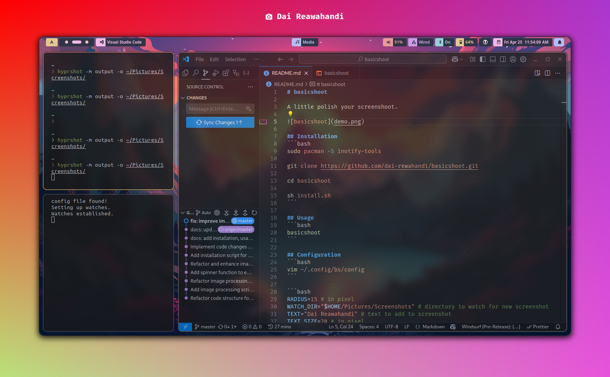
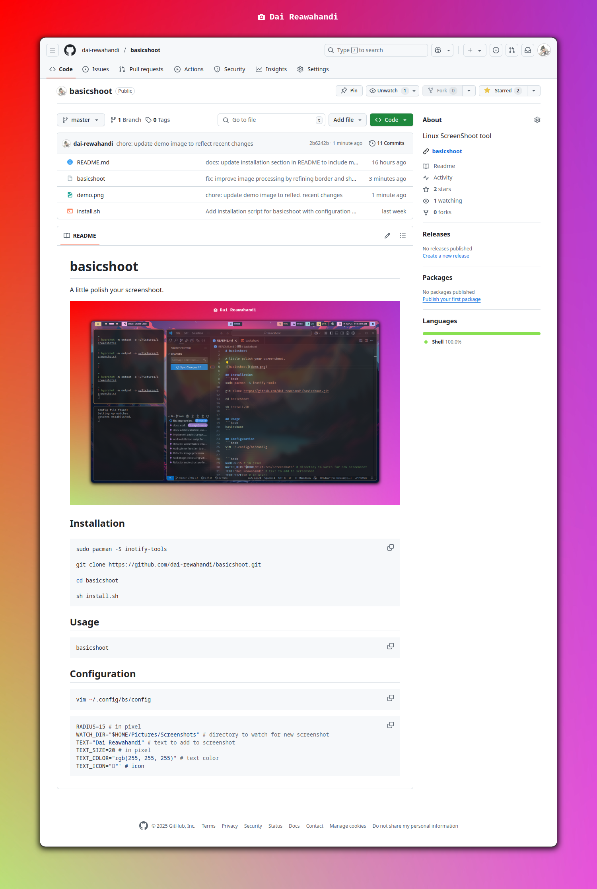

# basicshoot

A little polish your screenshoot.





## Installation
```bash
git clone https://github.com/dai-rewahandi/basicshoot.git
cd basicshoot

sh install.sh
```

## Usage
```bash 
1. Run => basicshoot
2. Take screenshot with app whatever you want
3. check your screenshot/good folder
```

## Configuration
```bash
vim ~/.config/bs/config
```

```bash
RADIUS=15 # in pixel
WATCH_DIR="$HOME/Pictures/Screenshots" # directory to watch for new screenshot
TEXT="Dai Reawahandi" # text to add to screenshot
TEXT_SIZE=20 # in pixel
TEXT_COLOR="rgb(255, 255, 255)" # text color
TEXT_ICON="󰄀"' # icon
```